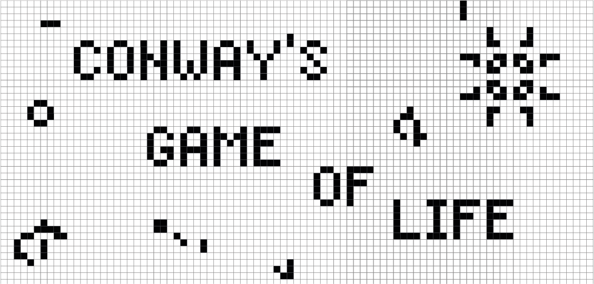

# Game of Life by Conway

This code implements the Game of Life, a cellular automaton devised by the British mathematician John Horton Conway in 1970. The game consists of a grid of cells that can be in one of two states: alive or dead. The state of each cell in the next generation is determined by its current state and the states of its eight neighbors.

To run the game, simply execute the `src/main.py` script. You can create the initial state of the grid by clicking in the generated display after that. The game will run after you set initial state and press space bar.

Enjoy!
